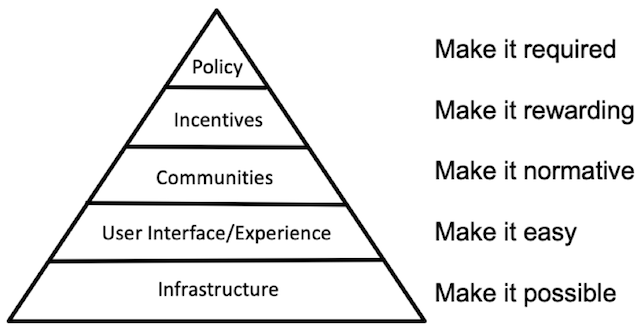

```{r setup, include=FALSE}
  # "`r parse(text=paste('20^text', ' May 2021'))`"
knitr::opts_chunk$set(echo = FALSE,
                      message=FALSE, 
                      warning=FALSE)
# download.file("https://drive.google.com/uc?export=download&id=1wuMqL_Z8T9rxuGvn0VP6siag90kHDm2O",
#               "slides/www/references.bib", overwrite = T)
library(fontawesome)
# library(rmarkdown)
```

## The Problem

<div class="container">

<div class="box60 hanging">
`r fa(name = "map-signs", fill="grey", width = "20px")`  __inferences__ we can draw from research syntheses<br />
__depend on the decisions__ in the research process<br /><span class="mysource">[@ioannidis.2016]</span>
<br />
_e.g. "garbage in garbage out"_ <br /><span class="mysource">[@eggeretal.2001]</span>

\
\

`r fa(name = "expand-arrows-alt", fill="grey", width = "20px")` __degrees of freedom__, e.g. in  
- literature search  
- eligibility criteria  
- strategy for data synthesis 

\
\

`r fa(name = "search", fill="grey", width = "20px")` __transparency__ allow for critical evaluation & enhance reproducibility <br /><span class="mysource">[@wilson.2019]</span>
</div>

<div class="box40">
</div>
</div>

<div id="choices">
</div>


<div class="notes">
* Metaanalysen häufig als objektiv und "die Wahrheit" wahrgenommen werden
* Changes within the scope of literature search, such as altering used databases or updating the search string may result in a difference of several hundred hits. Readers that are unaware of changes and reasons of change in the literature search lack important information to critically evaluate the continuation or termination of literature search.
* Updates to eligibility criteria is a standard procedure when conducting research synthesis. However, changes need to be made transparent, justified, and potential consequences reasoned as they directly determine the pool of literature that form the basis of the synthesis.
* Readers’ inferences to be drawn from the paper heavily depend on their ability to distinguish between exploratory parts of data analysis that may develop in the process of a research synthesis and confirmatory parts assumed a priori.
</div>

## The Problem

<div class="container">
<div class="box60 hanging">
`r fa(name = "lock-open", fill="grey", width = "20px")` __Open Science Practices__ help to make research transparent and reproducible<br /><span class="mysource">[@pageetal.2021]</span><br /><br />

\
\

`r fa(name = "clipboard-check", fill="grey", width = "20px")` __preregistration__ makes research syntheses as a process transparent<br /><span class="mysource">[@atkinsonetal.2015; @stewartetal.2012]</span><br /><br />

\
\

`r fa(name = "list-alt", fill="grey", width = "20px")` preregistration of research syntheses is __not standard__ procedure yet (outside of health)<br /><span class="mysource">[@ioannidis.2016; @molleretal.2018]</span>

</div>

<div class="box40">
</div>
</div>

<div id="prereg-bg">
</div>


## Existing solutions? | important frameworks

<div class="container">
<div class="box60 hanging">
`r fa(name = "hand-point-right", fill="grey", width = "20px")` PROSPERO <br /><span class="mysource">[@boothetal.2012]</span>
\

`r fa(name = "hand-point-right", fill="grey", width = "20px")` PRISMA-P <br /><span class="mysource">[@moheretal.2015]</span>
\

`r fa(name = "hand-point-right", fill="grey", width = "20px")` MARS <br /><span class="mysource">[@appelbaumetal.2018]</span>

</div>

<div class="box40">
</div>
</div>

<div id="solutions">
</div>

<div class="notes">
* betonen, dass die Fachspezifisch sind, nicht für behavioral science passen, und dass MARS eher ne guideline zum Manuskriptschreiben ist
* 
</div>


## Existing solutions? | important frameworks

<div class="container">
<div class="box60 hanging">
`r fa(name = "hand-point-right", fill="grey", width = "20px")` PROSPERO <br /><span class="mysource">[@boothetal.2012]</span>
\

`r fa(name = "hand-point-right", fill="grey", width = "20px")` PRISMA-P <br /><span class="mysource">[@moheretal.2015]</span>
\

`r fa(name = "hand-point-right", fill="grey", width = "20px")` MARS <br /><span class="mysource">[@appelbaumetal.2018]</span>

\
\

`r fa(name = "exclamation-circle", fill="grey", width = "20px")` discipline-specific frameworks <br /><br /><br />

`r fa(name = "exclamation-circle", fill="grey", width = "20px")` "Preregistration is hard" <br />
_e.g. including power analysis, coding manual, data analysis strategy_<span class="mysource">[@noseketal.2019]</span>
</div>

<div class="box40">
</div>
</div>

<div id="solutions">
</div>

<div class="notes">
* betonen, dass die Fachspezifisch sind, nicht für behavioral science passen, und dass MARS eher ne guideline zum Manuskriptschreiben ist
* 
</div>


## Existing solutions? | important frameworks

<div class="container">
<div class="box30">
\
\
\
\
\
If we want culture change, we need to "make it easy" <br /><span class="mysource">[@nosek.2019]</span>
</div>

<div class="box60">

</div>
</div>

<div class="notes">
da Metaanalysen oft von "Themenexperten" und nicht Methodenexperten gemacht werden und daher Respekt/Angst vor der Aufgabe bestehen könnte
</div>


## Our Context
<div class="container">
<div class="box49" style="text-align:center;">
{width=50%}  
__<span style="font-size:2em; font-weight:900">TüDiLB</span>__  
<span style="font-size:1em; font-weight:10">[www.tuedilb-tuebingen.de](https://www.tuedilb-tuebingen.de/)</span>  
\
\
Joint project of  
<span style="font-weight:bold; color:#a51e37">University of Tübingen</span> and  
<span style="font-weight:bold; color:#ff6900">Leibniz-Institut für Wissensmedien (IWM)</span>
</div>
<div class="box49" style="margin-top:10%">
__Research group "Transformation & Translation"__<br /><br />
`r fa(name = "arrow-circle-right", fill="grey", width = "20px")` research syntheses on the topic of digitization<br /><br />
`r fa(name = "arrow-circle-right", fill="grey", width = "20px")` in teaching and teacher education
</div>
</div>


## Our Aims

<div class="container">
<div class="box60 hanging">

• utilize __existing__ frameworks and __standards__
\
\

• make them __accessible__ & __applicable__<br />
  - for meta-analyses and systematic reviews<br />
  - for all disciplines
\
\

• enable __seamless integration__ of data analyses, files, figures, text, ...
\
\

• ensure __compatibility__ with markup languages
\
\
\

`r fa(name = "arrow-circle-right", fill="grey", width = "20px")` produce __standalone__ HTML/PDF


</div>

<div class="box40">
</div>
</div>

<div id="aims">
</div>

## preregRS | R package

<div class="container">
<div class="box60">
preregRS = R Markdown template (install via [R-package](https://github.com/j-5chneider/preregRS))

* provides __structure__: synthesized <br />PROSPERO, PRISMA-P and MARS

</div>

<div class="box40"></div>
</div>

<div id="sec-tab"></div>

## preregRS | R package

<div class="container">
<div class="box60">
preregRS = R Markdown template (install via [R-package](https://github.com/j-5chneider/preregRS))

* provides __structure__: synthesized <br />PROSPERO, PRISMA-P and MARS<br /><br />
* __guides__ with additional information

</div>

<div class="box40"></div>
</div>

<div id="add-info"></div>


## preregRS | R package

<div class="container">
<div class="box60">
preregRS = R Markdown template (install via [R-package](https://github.com/j-5chneider/preregRS))

* provides __structure__: synthesized <br />PROSPERO, PRISMA-P and MARS<br /><br />
* __guides__ with additional information<br /><br />
* fill out like a form: provides __placeholders__

</div>

<div class="box40"></div>
</div>

<div id="add-text"></div>


## preregRS | R package

<div class="container">
<div class="box60">
preregRS = R Markdown template (install via [R-package](https://github.com/j-5chneider/preregRS))

* provides __structure__: synthesized <br />PROSPERO, PRISMA-P and MARS<br /><br />
* __guides__ with additional information<br /><br />
* fill out like a form: provides __placeholders__<br /><br />
* R Markdown enables us to... 

<span style="margin-left:50px;">
`r fa(name = "file-code", fill="grey", width = "20px")` include R __code__ and its __output__<br />
</span>
<span style="margin-left:50px;">
`r fa(name = "file-pdf", fill="grey", width = "20px")` encode __files__ (e.g. separate coding system)<br />
</span>
<span style="margin-left:50px;">
`r fa(name = "chart-area", fill="grey", width = "20px")` include __figures__, iframes, latex, ...<br />
</span>
<span style="margin-left:50px;">
`r fa(name = "hand-pointer", fill="grey", width = "20px")` include __interactive__ content (e.g. plotly)<br />
</span>

</span>
<span style="margin-left:50px;"></div>

<div class="box40" style="margin-top:30%">
</div>
</div>

<div class="notes">

* __guides__ users through the process (additional information on standards available)
* R Code: (e.g. for power analyses, planned analysis code) 

</div>


## preregRS | R package

<div class="container">
<div class="box60">
preregRS = R Markdown template (install via [R-package](https://github.com/j-5chneider/preregRS))

* provides __structure__: synthesized <br />PROSPERO, PRISMA-P and MARS<br /><br />
* __guides__ with additional information<br /><br />
* fill out like a form: provides __placeholders__<br /><br />
* R Markdown enables us to... 

<span style="margin-left:50px;">
`r fa(name = "file-code", fill="grey", width = "20px")` include R __code__ and its __output__<br />
</span>
<span style="margin-left:50px;">
`r fa(name = "file-pdf", fill="grey", width = "20px")` encode __files__ (e.g. separate coding system)<br />
</span>
<span style="margin-left:50px;">
`r fa(name = "chart-area", fill="grey", width = "20px")` include __figures__, iframes, latex, ...<br />
</span>
<span style="margin-left:50px;">
`r fa(name = "hand-pointer", fill="grey", width = "20px")` include __interactive__ content (e.g. plotly)<br />
</span>

</span>
<span style="margin-left:50px;"></div>

<div class="box40" style="margin-top:30%">
<br />
`r fa(name = "file-export", fill="grey", width = "30px")` compile to __standalone__ file
</div>
</div>

<div class="notes">

* __guides__ users through the process (additional information on standards available)
* R Code: (e.g. for power analyses, planned analysis code) 

</div>


# Demo

<div class="fullscreenac"></div>


## Demo | check out...

1. an empty template (compiled to HTML): [bit.ly/preregRS-HTML](https://bit.ly/preregRS-HTML)  <br /><br />
2. a Jupyter-Notebook with preregRS template available: [bit.ly/preregRS-jupyter](https://bit.ly/preregRS-jupyter)  <br /><br />
3. a partial example of a preregistration: [bit.ly/preregRS-example](https://bit.ly/preregRS-example)  


## Further developments

* Increase usability & accessibility outside of R<br />_e.g. [JBI SUMARI](https://www.jbisumari.org/#tutorials)_


# {-}


<div id="refs"></div>


# &nbsp;
__Images__  
(in order of appearance)  
  
<span style="font-size:.7em;">
title page icons | [fontawesome.com CC-BY 4.0](https://fontawesome.com/license/free) (incons used throughout the slides)   
title page background | <a href="https://unsplash.com/@bogdan_karlenko?utm_source=unsplash&utm_medium=referral&utm_content=creditCopyText">Bogdan Karlenko</a> on <a href="https://unsplash.com/?utm_source=unsplash&utm_medium=referral&utm_content=creditCopyText">Unsplash</a>
<a href="https://unsplash.com/@soymeraki?utm_source=unsplash&utm_medium=referral&utm_content=creditCopyText">Javier Allegue Barros</a> on <a href="https://unsplash.com/?utm_source=unsplash&utm_medium=referral&utm_content=creditCopyText">Unsplash</a>  
Center for Open Science [osf.io/sxn73/](https://osf.io/sxn73/)  
<a href="https://unsplash.com/@mariannebos?utm_source=unsplash&utm_medium=referral&utm_content=creditCopyText">marianne bos</a> on <a href="https://unsplash.com/s/photos/solution?utm_source=unsplash&utm_medium=referral&utm_content=creditCopyText">Unsplash</a>  
<a href="https://unsplash.com/@bogdan_karlenko?utm_source=unsplash&utm_medium=referral&utm_content=creditCopyText">Bogdan Karlenko</a> on <a href="https://unsplash.com/?utm_source=unsplash&utm_medium=referral&utm_content=creditCopyText">Unsplash</a>
</span>